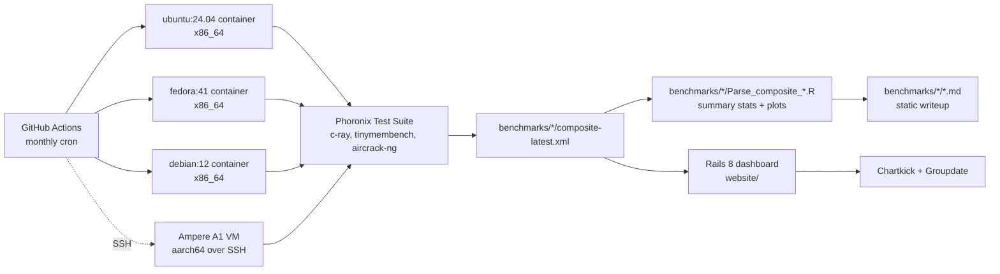

<picture>
  <source media="(prefers-color-scheme: dark)"  srcset="assets/banner-dark.svg"  type="image/svg+xml">
  <source media="(prefers-color-scheme: light)" srcset="assets/banner-light.svg" type="image/svg+xml">
  <source media="(prefers-color-scheme: dark)"  srcset="assets/banner-dark.png">
  <source media="(prefers-color-scheme: light)" srcset="assets/banner-light.png">
  
</picture>

[](https://github.com/Builder106/linux-bench-hub/actions/workflows/ci.yml)
[](https://www.ruby-lang.org/)
[](https://rubyonrails.org/)
[](#license)
[](#project-status)
[](https://linuxbenchhub.vercel.app/)

> **Automated performance testing for Linux.** Compares the speed and memory efficiency of Ubuntu, Fedora, and Debian on identical virtual machines.

## 💡 What is LinuxBenchHub?

Different flavors of Linux (Ubuntu, Fedora, Debian) often claim performance advantages, but comparing them fairly requires running identical tests on identical virtual hardware. LinuxBenchHub automates monthly speed, CPU, and memory benchmarks across operating systems, publishing clear comparison charts and raw data to show which setup is truly fastest.

LinuxBenchHub runs Phoronix Test Suite across identical virtual hardware, captured monthly in GitHub Actions CI, with a Rails 8 showcase and static export pipeline.

**Live demo:** [linuxbenchhub.vercel.app](https://linuxbenchhub.vercel.app/)

## 🛠 Architecture & Components

LinuxBenchHub has three core components:

1. **Benchmark dataset and writeup pipeline** under [`benchmarks/`](benchmarks/): Automated test results measuring CPU math, memory throughput, and network performance across Linux distributions. A Ruby script (`benchmarks/generate_writeup.rb`) converts raw benchmark data into clean markdown reports.
2. **Automated testing pipeline** under [`.github/workflows/capture-benchmarks.yml`](.github/workflows/capture-benchmarks.yml): A monthly automated workflow that runs identical speed tests across Ubuntu, Fedora, and Debian on both standard x86 computers and ARM64 cloud servers.
3. **Web dashboard** under [`website/`](website/): A clean Rails showcase that renders performance comparison charts and exports static web pages for deployment.

## Sample results (Ubuntu 24.04 Performance)

The dataset tests two distinct computer architectures:
- **x86 PC architecture**: Tested on an Intel Core i5 processor with 4 GB RAM.
- **ARM64 cloud architecture**: Tested on an Oracle Cloud Ampere A1 server with 4 CPU cores and 24 GB RAM.

| Benchmark Test | What it measures | Unit | Intel Core i5 (x86) | Ampere A1 (ARM64) | Takeaway |
| --- | --- | --- | --- | --- | --- |
| **C-Ray** | 3D rendering computation (CPU) | Seconds (lower is better) | 1,088.8 | **212.0** | Ampere is ~5x faster |
| **Tinymembench (memcpy)** | Memory copying speed | MB/sec (higher is better) | 11,209.5 | **12,155.5** | Comparable speeds |
| **Tinymembench (memset)** | Memory allocation speed | MB/sec (higher is better) | 23,480.2 | **47,575.6** | Ampere is ~2x faster |
| **Aircrack-ng** | Cryptographic key calculation | Keys/sec (higher is better) | **4,542.6** | 4,154.3 | Intel is slightly faster |

Headline takeaway: The cloud ARM server is **~5x faster at multi-threaded calculation** and **~2x faster at memory writes**, while single-core encryption speed is very close between both platforms.

Full per-distribution data and reports:

- [**`benchmarks/ubuntu/ubuntu.md`**](benchmarks/ubuntu/ubuntu.md): Ubuntu 24.04 (Intel x86)
- [**`benchmarks/ubuntu-arm64/composite-latest.xml`**](benchmarks/ubuntu-arm64/composite-latest.xml): Ubuntu 24.04 (Ampere ARM64)
- [**`benchmarks/fedora/fedora.md`**](benchmarks/fedora/fedora.md): Fedora Linux 41
- [**`benchmarks/debian/debian.md`**](benchmarks/debian/debian.md): Debian 12

## How the pieces fit



The R parsers and the Rails app are interchangeable consumers of the same `composite.xml` data. You can run the static analysis with R alone, boot the dashboard alone, or use both together.

## Repo layout

```text
.
|-- benchmarks/              # captured benchmark results, per platform
|   |-- ubuntu/              #   ubuntu.md + Parse_composite_Ubuntu.R + composite-latest.xml
|   |-- ubuntu-arm64/        #   Ampere A1 aarch64 captures (CI-captured over SSH)
|   |-- fedora/
|   `-- debian/
|-- infra/
|   `-- oci-ampere/          # OpenTofu module: Always-Free Ampere A1 host for arm64 captures
|-- .github/
|   |-- workflows/
|   |   |-- capture-benchmarks.yml   # monthly CI capture (containers + Ampere SSH)
|   |   |-- ci.yml                    # Rails test suite gate
|   |   `-- deploy.yml                # Rails app deploy
|   `-- scripts/
|       `-- pts-batch-config.xml      # seeded into benchmark suite before non-interactive runs
|-- website/                 # Rails 8 dashboard (incl. the /showcase writeups)
|   |-- app/                 #   models, controllers, views
|   |-- config/              #   routes, Whenever schedule
|   `-- Dockerfile           #   production image
|-- linux_benchmarking.rb    # standalone CLI script for ad-hoc runs
|-- .lintr                   # R linter config for the Parse_composite_*.R scripts
`-- assets/                  # banner + social card
```

## Setup

### Capturing fresh benchmarks

Captures happen automatically on the 1st of every month via [`.github/workflows/capture-benchmarks.yml`](.github/workflows/capture-benchmarks.yml). To trigger an ad-hoc run, use the "Run workflow" button on the GitHub Actions tab.

To re-derive markdown writeups from `composite.xml` files locally:

```bash
# Generate markdown writeups from composite XML
ruby benchmarks/generate_writeup.rb
```

## Capturing arm64 (Ampere)

The ARM64 tests run on a long-lived Oracle Cloud Always-Free Ampere A1 server. Cloud infrastructure setup is managed via OpenTofu in [`infra/oci-ampere/`](infra/oci-ampere/).

### Running the Rails showcase & static export

```bash
cd website
bundle install
bin/rails server

# To export static HTML/assets for Vercel deployment
bin/rails export:static
```

The Rails showcase parses per-distribution writeups via [`DistroBenchmark`](website/app/models/distro_benchmark.rb). Static export writes to [`website/export/`](website/export/) which is deployed to Vercel via [`vercel.json`](vercel.json).

## Project status

- **Ubuntu / Fedora / Debian (x86_64)**: Monthly containerized benchmark runs captured in GitHub Actions into `benchmarks/<distro>/`.
- **Ubuntu / Fedora / Debian arm64 (Ampere A1)**: Captured natively over SSH against an Oracle Cloud Ampere VM.
- **Ruby parser pipeline**: [`benchmarks/generate_writeup.rb`](benchmarks/generate_writeup.rb) turns raw XML outputs into structured markdown writeups.
- **Rails 8 showcase & static export engine**: Live at [`linuxbenchhub.vercel.app`](https://linuxbenchhub.vercel.app/).
- **Cross-distro comparison view**: Side-by-side metric tables and interactive filtering across distributions.

## Tech stack

- **Benchmarks**: Phoronix Test Suite, Ruby (`benchmarks/generate_writeup.rb`)
- **Capture (x86)**: GitHub Actions (monthly cron, distribution containers on `ubuntu-latest`)
- **Capture (arm64)**: Oracle Cloud Ampere A1 (Ubuntu 24.04 aarch64) driven over SSH
- **Infrastructure**: OpenTofu (see [`infra/oci-ampere/`](infra/oci-ampere/))
- **Showcase**: Rails 8.0, Ruby, Static Export, Vercel

## License

MIT (see [LICENSE](LICENSE)).

Code released under the [MIT License](LICENSE). Third-party components retain their upstream licenses: **Phoronix Test Suite**is GPLv3 (referenced, not bundled);**noVNC**, embedded under [`website/noVNC/`](website/noVNC/), is MPL-2.0; Rails and Ruby are MIT. Captured Phoronix outputs under `benchmarks/*/` are derivative works of the upstream tests.
